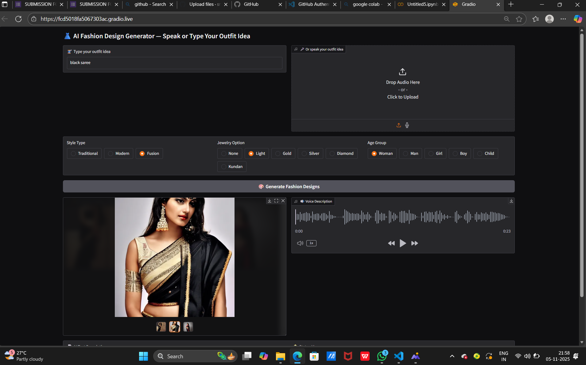
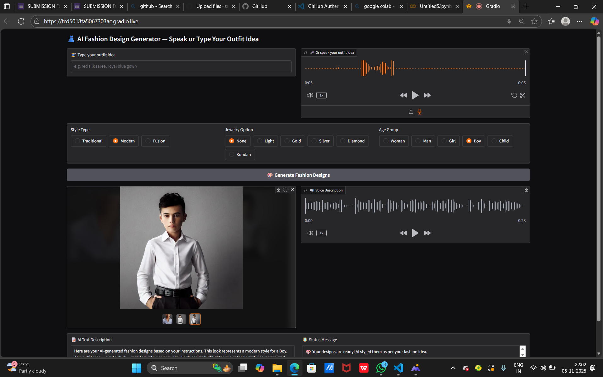
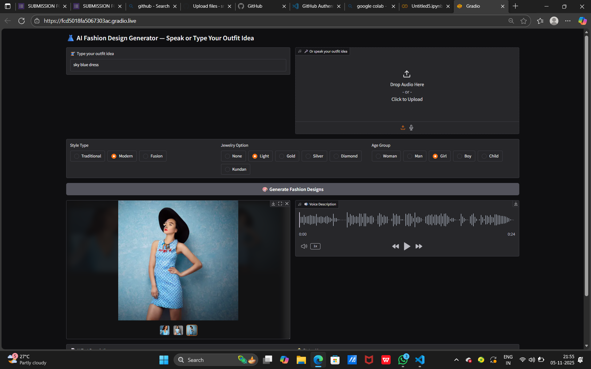

# 👗 AI Fashion Design Generator

An innovative *AI-powered fashion design tool* that lets you *type or speak* your outfit idea and instantly generates *realistic fashion images* using *Stable Diffusion*.  
Ideal for *fashion designers, students, or creative artists* who want fast visual inspiration with AI assistance.

## ✨ Features

- 🎙️ *Voice + Text Input* — Describe your outfit by typing or speaking.  
- 👗 *AI-Generated Designs* — Creates ultra-realistic 8K outfit visuals using Stable Diffusion.  
- 💍 *Customizable Options* — Choose style (Traditional, Modern, Fusion), jewelry, and age group.  
- 🗣️ *Voice Description* — Auto-generates a spoken outfit description using Google Text-to-Speech (gTTS).  
- 🖼️ *Multiple Designs* — Produces 3 unique image variations per request.  
- 💻 *Interactive Gradio UI* — Simple and elegant interface for easy use.

- ## Install all dependencies:

pip install -r requirements.txt

## Run the App:
python ai-fashion-design-assistant.py

## Project Structure

AI_Fashion_Design_Generator/
│
├── ai-fashion-design-assistant.py    
├── requirements.txt             
├── README.md                    
├── Output1                      
├── Output2
└── Output3

## Limitations

🕓 Image generation can be slow on CPU — GPU recommended for faster results.

🎤 Voice recognition accuracy depends on microphone clarity and internet connection.

🌐 Requires internet access for gTTS and speech recognition.

💾 Generated images are not stored automatically unless code is modified to save them.

## App Preview

## Future Enhancements

✨ Add fabric texture controls (silk, cotton, velvet, etc.)

🧠 Integrate advanced Stable Diffusion XL for better details

💾 Automatic image download/save options

🎞️ Option to generate a short fashion showcase video
